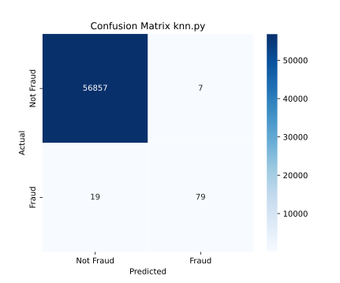
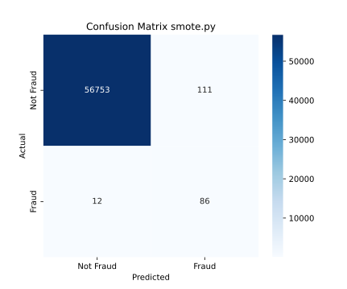
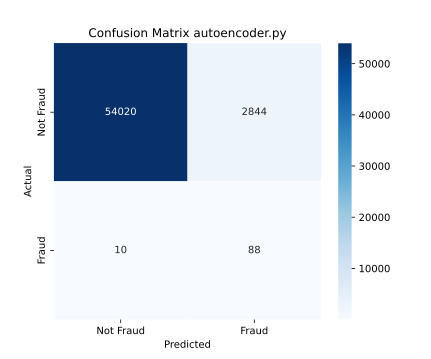

# ML for Credit Card Fraud Detection
### https://www.kaggle.com/datasets/mlg-ulb/creditcardfraud/data

---

## KNN 
### neighbour=5, StandardScaler
- Recall: 0.9999
- Correctly detected frauds (%): 80.6122%

---

## KNN + SMOTE
### neighbour=5, StandardScaler + SMOTE
- Recall: 0.9980
- Correctly detected frauds (%): 87.7551%

---

## LogisticRegression
### StandardScaler, weights
- Recall: 0.9742
- Correctly detected frauds (%): 91.8367%

---

## Autoencoder
### MSE, Adam, batch_size: 1024, epochs: 50, layers: input_size, 16, 8, 8, 4, 4, threshold: 0.95 percentile
- Recall: 0.9500
- Correctly detected frauds (%): 89.7959%

